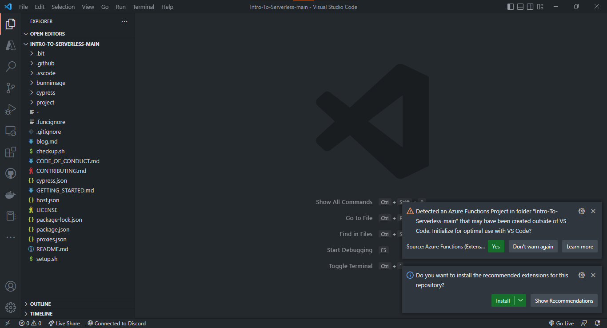

# Week 1: Say Hello to VSCode

Week 1 Step 1 ⬤◯◯◯ | 🕐 Estimated completion: 5-20 minutes

## Tasks:

- [ ] ***1:*** Download Visual Studio Code and install the **Azure Tools** and **Live Server** extensions
- [ ] ***2:*** Clone this repo using the terminal on VS Code <!--TODO: Update Repo-->
- [ ] ***3:*** In a new file called `week1/helloworld.js`, write and export a JS function `hello` that returns "Hello World"

**Tip**: When we tell you to name a file called `directory/thefile.js`, the first part before the `/` is a directory (otherwise known as a folder).

## 1: The IDE - Visual Studio Code

An IDE is a software application that provides comprehensive facilities to computer programmers for software development. An IDE normally consists of at least a source code editor, build automation tools, and a debugger. Although there are hundreds of IDEs to choose from, we are going to use Visual Studio Code due to its popularity and integration with Azure (via extensions and libraries).

[Download VS Code](https://code.visualstudio.com/download) for your operating system and check out this <a href="https://www.youtube.com/watch?v=VqCgcpAypFQ">tutorial</a> before getting started.

Inside VS Code, download the following extensions:

- [Azure Tools (includes Azure Account, Azure App Service, Azure Functions)](https://marketplace.visualstudio.com/items?itemName=ms-vscode.vscode-node-azure-pack)
- [ESLint](https://marketplace.visualstudio.com/items?itemName=dbaeumer.vscode-eslint)
    - [Setup Video](https://www.youtube.com/watch?v=5IGVeq2DdsA)
- [Live Server](https://marketplace.visualstudio.com/items?itemName=ritwickdey.LiveServer)

All of the Azure extensions allow you to work on your Azure Function App in VS Code instead of working directly through the Microsoft portal. Live Server is a quick and temporary testing server, and you can use it to test HTML pages. To launch, right click on your html file and press "Open with Live Server" or click "Go Live" in the bottom right corner:


> 💡 Note: Dark Theme is our personal favorite, but feel free to choose whichever theme you like best. Go to [this site](https://code.visualstudio.com/docs/getstarted/themes) to view your options!


## 2: Clone Files
1. Navigate to the [repo](https://github.com/NCVirtual-Coding-Club/Intro-To-Serverless)
2. Click on `<> code`
3. Click `Download ZIP`
4. Extract the downloaded folder.
5. Open the folder in VS Code
    1. Open VS Code
    2. Select `File`
    3. Select `Open Folder`
    4. Select the downloaded and extract folder


Your VS Code window should look like the following:


## 3: Writing and Exporting a JavaScript function

JavaScript enables the ability to [export functions](https://developer.mozilla.org/en-US/docs/web/javascript/reference/statements/export) in a program so that you can access them in other parts of the program via the import statement. In this case, we want to export your programs in order for CounselorBot to check your code.

### What are JavaScript and Node.js?
JavaScript is the language of the internet! It is a powerful tool for creating complex web apps. However, JavaScript can be used for building the client for applications, and sometimes requires a way to access this client, which is also known as the server-side. Node.js is the solution to this problem, and allows you to write and run code not linked to a website locally.

Make sure you have Node.js and npm installed before moving forwards: https://www.npmjs.com/get-npm. As we are using Azure Functions make sure that you install a supported [LTS release](https://nodejs.org/en/about/releases/) of Node.js. You find the currently supported releases in the [Azure Functions documentation](https://docs.microsoft.com/azure/azure-functions/functions-reference-node?tabs=v2-v3-v4-export%2Cv2-v3-v4-done%2Cv2%2Cv2-log-custom-telemetry%2Cv2-accessing-request-and-response%2Cwindows-setting-the-node-version#node-version).

- Check if Node.js is installed: run `node -v` in your terminal
- Check if npm is installed: run `npm -v` in your terminal

If you would like to read more, refer to [this article](https://developer.mozilla.org/en-US/docs/Learn/JavaScript/First_steps/What_is_JavaScript) on JavaScript and [this article](https://www.tutorialspoint.com/nodejs/nodejs_introduction.htm) on Node.js.

### How do I export a function?
Let's say your function name is `hello`. To export it, add this line of code at the very bottom of your file outside of your function: `module.exports = hello`.

Example:

```js
function hello() {
    // your code
} 

module.exports = hello
```
When you commit the file, we will try to run the function by importing it and compare it's output to the expected output like so:

```js
const hello = require('../../week1/helloworld.js')
const output = hello()
```

### How does this apply to code in the real world?

Just like you can import code from modules other people have written, you can also **import functions you wrote from *other files* to reuse them.** In function oriented programming, you use functions over and over again to save code. If you want to use the function `hello()` in another file, you would need to import it.

### Detailed Steps

1. Create a new file
2. Name the file `helloworld.js`
3. Write your code
4. If you have Node.js installed on your computer, open terminal on VS Code and type 'node helloworld.js'
5. If you have not installed Node.js on your computer, you will need to do that first: https://nodejs.org/en/download/
6. Tip: to test your function, call it in your code.
7. Create a new branch named `week1` and commit your `helloworld.js` file in the root directory.

> :bulb: Try to not use the web editor! Commit from your command line.

### The Commands

Navigate to the directory in your command line where you want to keep your repository (folder).

> Tip: Use `cd ./your-directory` to change directories, `pwd` to find out where you are, and `ls` to list files & directories. More information is [here](https://www.earthdatascience.org/courses/intro-to-earth-data-science/open-reproducible-science/bash/bash-commands-to-manage-directories-files/). 

## Test your Work

If you run `node helloworld.js` in the terminal, the output should be `Hello World`

### My code failed, what do I do?

No worries, check [this out](https://github.com/bitprj/Intro-To-Serverless/blob/main/GETTING_STARTED.md#x-the-step-failed-what-do-i-do) to help resolve the issue.

## 📹 Walkthrough Video
Please note that committing to GitHub will not be necessary.
[](https://www.youtube.com/watch?v=y9_lTjARWAg)
